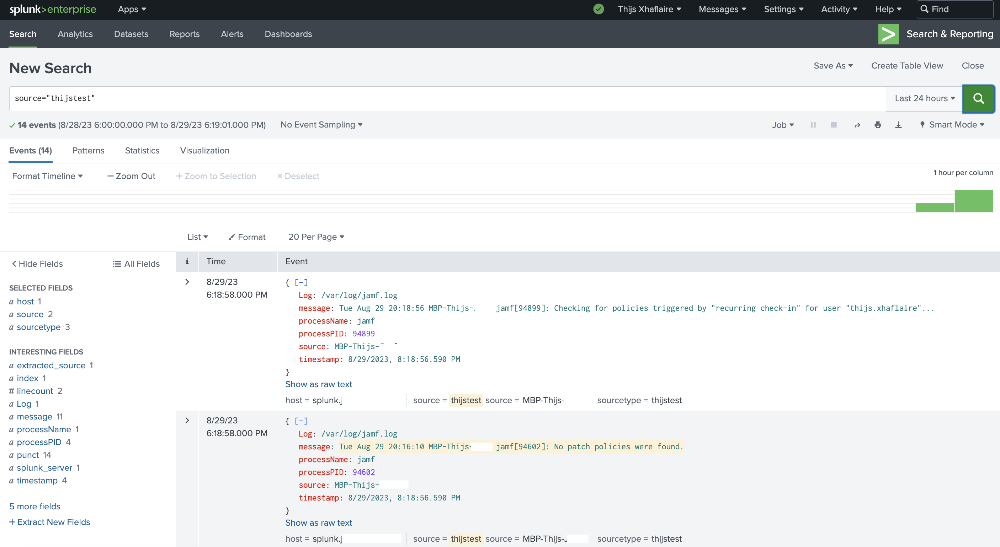

# EndpointLogStreamer

&nbsp;&nbsp;


A native code-signed and notarized macOS Swift binary that allows to monitor one or multiple **simple log files** and stream new entries to an **HTTP Endpoint** like Splunk or Elastic or to an **Microsoft Log Analytics Workspace** in an way system performance is respected.


> [!NOTE]  
> The current release is a 0. release and is still under development

You will find the latest release in the [releases](https://github.com/txhaflaire/EndpointLogStreamer/releases) section.


##### Configuration

As with many tools, also **EndpointLogStreamer** does require a minimal configuration in order to function.

Provided in this repository you will find an Jamf Pro JSON Schema for EndpointLogStreamer to easily configure it within Jamf Pro, alternatively you will also find an example plist which can be used as baseline as well which can be distributed by any MDM.

To find out more about managing **EndpointLogStreamer** please refer to the [Wiki](https://github.com/txhaflaire/EndpointLogStreamer/wiki/Managing-EndpointLogStreamer-Configuration) on this GitHub repository.

> [!NOTE]  
> To respect system performance and ensure keep the footprint as low as possible all new log entries are being added to a buffer, once the buffer either reaches 5000 bytes or 180 seconds the buffer with entries are flushed and streamed to either the HTTP Endpoint, Log Analytics workspace or even both!


*Jamf Pro JSON App Manifest*


##### Persistence

To ensure EndpointLogStreamer automatically runs after installation, a LaunchDaemon is included in the installer and up on load it will execute the EndpointLogStreamer binary and starts monitoring and streaming logs.

```
<?xml version="1.0" encoding="UTF-8"?>
<!DOCTYPE plist PUBLIC "-//Apple//DTD PLIST 1.0//EN" "http://www.apple.com/DTDs/PropertyList-1.0.dtd">
<plist version="1.0">
<dict>
	<key>Label</key>
	<string>com.txhaflaire.els</string>
	<key>Program</key>
	<string>/usr/local/bin/EndpointLogStreamer</string>
	<key>RunAtLoad</key>
	<true/>
</dict>
</plist>
```

##### Logging

In order to troubleshoot we need logs, EndpointLogStreamer does write extensively to the **Unified Logging subsystem**.
To review logs that are generated by EndpointLogStreamer you could start by running either one of the following commands.


*Log Show example*
```
log show --predicate 'subsystem == "com.txhaflaire.els"' --info
```

*Log Stream example*
```
log stream --predicate 'subsystem == "com.txhaflaire.els"' --info --last 2h
```

*Output*
```
2023-08-29 18:53:56.538 I  EndpointLogStreamer[84430:168bca] [com.txhaflaire.els:configuration] Configuration: HTTP Log Forwarder is enabled..
2023-08-29 18:53:56.538 I  EndpointLogStreamer[84430:168bca] [com.txhaflaire.els:configuration] Configuration: HTTP URL is set..
2023-08-29 18:53:56.538 I  EndpointLogStreamer[84430:168bca] [com.txhaflaire.els:configuration] Configuration: Log Analytics Forwarder is enabled..
2023-08-29 18:53:56.538 I  EndpointLogStreamer[84430:168bca] [com.txhaflaire.els:configuration] Configuration: The customerID is set.
2023-08-29 18:53:56.538 I  EndpointLogStreamer[84430:168bca] [com.txhaflaire.els:configuration] Configuration: The sharedKey is set.
2023-08-29 18:53:56.538 I  EndpointLogStreamer[84430:168bca] [com.txhaflaire.els:configuration] Configuration: Monitoring Log File - <private>
2023-08-29 18:53:56.540 I  EndpointLogStreamer[84430:168bca] [com.txhaflaire.els:configuration] Configuration: Monitoring Log File - <private>
2023-08-29 18:55:19.085 I  EndpointLogStreamer[84430:168bca] [com.txhaflaire.els:binary] Buffer Flush Check: Exceeded interval of 20.000000 seconds
2023-08-29 18:55:19.095 I  EndpointLogStreamer[84430:168bca] [com.txhaflaire.els:binary] Buffer Flush State: Flushed - <private>
2023-08-29 18:55:19.633 I  EndpointLogStreamer[84430:1693b9] [com.txhaflaire.els:sentinel] Sentinel: succesfully send log data to Analytics Workspace - 200
2023-08-29 18:55:20.360 I  EndpointLogStreamer[84430:1693b7] [com.txhaflaire.els:http] HTTP: Successfully sent log data to URL
2023-08-29 18:55:21.998 I  EndpointLogStreamer[84430:168bca] [com.txhaflaire.els:binary] Buffer Flush Check: Buffer Size: 71, Max Buffer Size: 5000
2023-08-29 18:55:21.998 I  EndpointLogStreamer[84430:168bca] [com.txhaflaire.els:binary] Buffer Flush State: Pending
2023-08-29 18:55:23.236 I  EndpointLogStreamer[84430:168bca] [com.txhaflaire.els:binary] Buffer Flush Check: Buffer Size: 148, Max Buffer Size: 5000
2023-08-29 18:55:23.236 I  EndpointLogStreamer[84430:168bca] [com.txhaflaire.els:binary] Buffer Flush State: Pending
```

#### Verified SIEM/HTTP Solutions

EndpointLogStreamer has been tested against the following solutions, please feel free to report back if you are using EndpointLogStreamer and it works or seems not to work with one of the solutions listed here.

- [x] Splunk Enterprise
- [x] Microsoft Log Analytics
- [ ] SumoLogic
- [ ] Elastic
- [ ] QRadar
- [x] Generic HTTP Webhook test sites, ex webhook.site


#### Sample Screenshots

*Microsoft Log Analytics Workspace*


*Splunk Enterprise*
